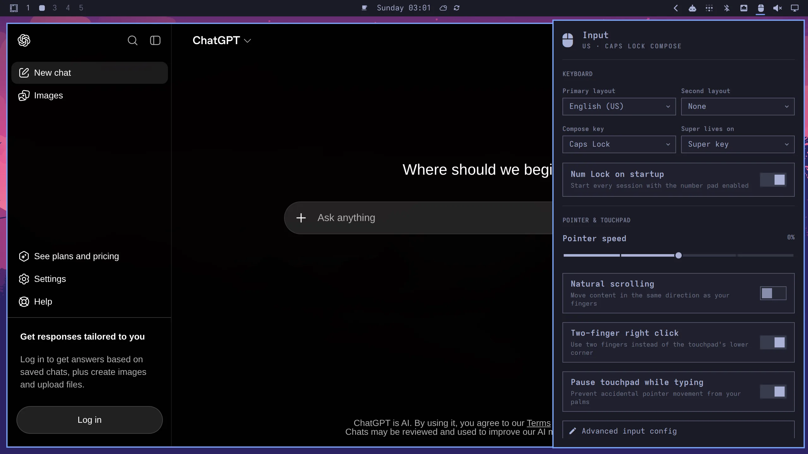
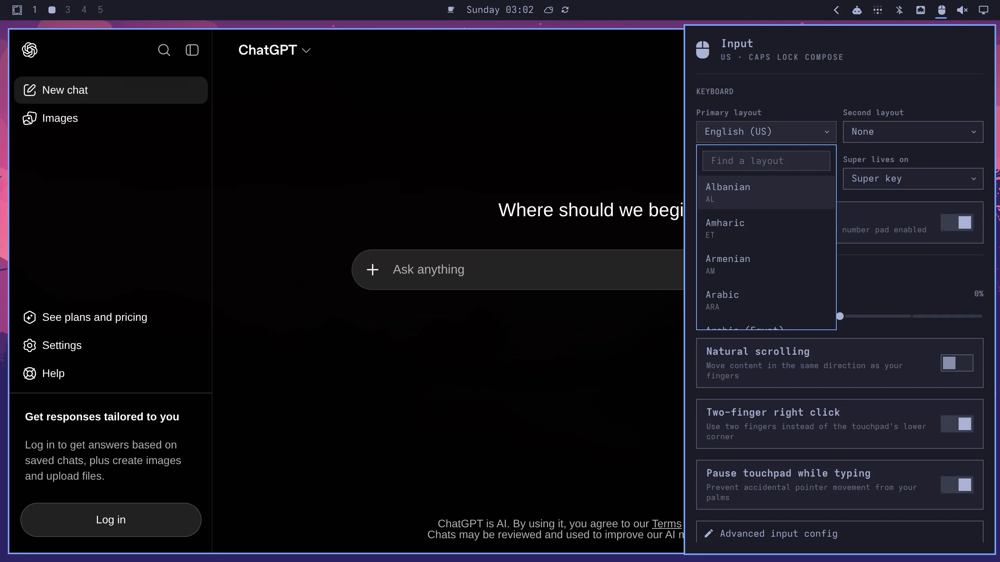

# Keyboard, Mouse, Trackpad

Open _Setup > Input_ in the Omarchy menu (`Super + Space`) for the settings most people need: keyboard layouts, Compose and Super keys, Num Lock, pointer speed, natural scrolling, and touchpad clicking. The same panel lives on the right side of the default bar.

Hyprland has many more input options. Choose _Advanced input config_ at the bottom of the panel to edit `~/.config/hypr/input.lua` for keyboard repeat, gestures, per-app scrolling, and other specialized settings.



The layout pickers search every layout installed with XKB, so adding another language does not turn the panel into a long list of regional options.



Here's an example:

```lua
hl.config({
  input = {
    -- Use multiple keyboard layouts and switch between them with Left Alt + Right Alt
    kb_layout = "us,dk",
    kb_options = "compose:caps,shift:both_capslock_cancel,grp:alts_toggle",

    -- Change speed of keyboard repeat
    repeat_rate = 40,
    repeat_delay = 600,

    -- Increase sensitivity for mouse/trackpad (default: 0)
    sensitivity = 0.35,

    touchpad = {
      -- Use natural (inverse) scrolling
      natural_scroll = true,

      -- Use two-finger clicks for right-click instead of lower-right corner
      clickfinger_behavior = true,

      -- Control the speed of your scrolling
      scroll_factor = 0.3,
    },
  },
})

-- Scroll faster in the terminal
o.window("(Alacritty|kitty|foot)", { scroll_touchpad = 1.5 })
```

You can [see all the input options](https://wiki.hypr.land/Configuring/Basics/Variables/#input) on the Hyprland wiki for inputs.

By default, Omarchy uses CapsLock as the compose key for [quick emojis](07-hotkeys.md#quick-emojis) and [other completions](07-hotkeys.md#quick-completions). If you'd rather use CapsLock as Caps Lock, choose Right Alt, Menu key, or Disabled under _Compose key_ in the Input panel. The equivalent advanced configuration is:

```lua
hl.config({
  input = {
    kb_options = "compose:ralt",
  },
})
```

### Trackpad gestures

You can also turn on [touchpad gestures](https://wiki.hypr.land/Configuring/Advanced-and-Cool/Gestures/), like swiping with three fingers to change workspaces:

```lua
hl.gesture({ fingers = 3, direction = "horizontal", action = "workspace" })
```

On Dell XPS laptops with a haptic touchpad, you can also set the click strength to low, mid, or high under _Trigger > Hardware > Touchpad Haptics_.

### Typing in Chinese, Japanese, and other languages

Omarchy runs the [fcitx5](https://fcitx-im.org/) input method framework as part of every session — it's what powers the CapsLock compose sequences. That means the plumbing for non-Latin input is already in place: install an input engine like `fcitx5-mozc` (Japanese) or `fcitx5-chinese-addons` (Chinese) with `omarchy pkg add`, plus `fcitx5-configtool` to add the engine to your input methods and set the key that switches between them.

### Use ALT as SUPER

On some keyboards, it's not convenient to use the primary meta key (Windows/cmd key) as SUPER. Choose _Alt key (swap)_ under _Super lives on_ in the Input panel. The equivalent advanced configuration is:

```lua
hl.config({
  input = {
    kb_options = "compose:caps,shift:both_capslock_cancel,altwin:swap_alt_win",
  },
})
```
